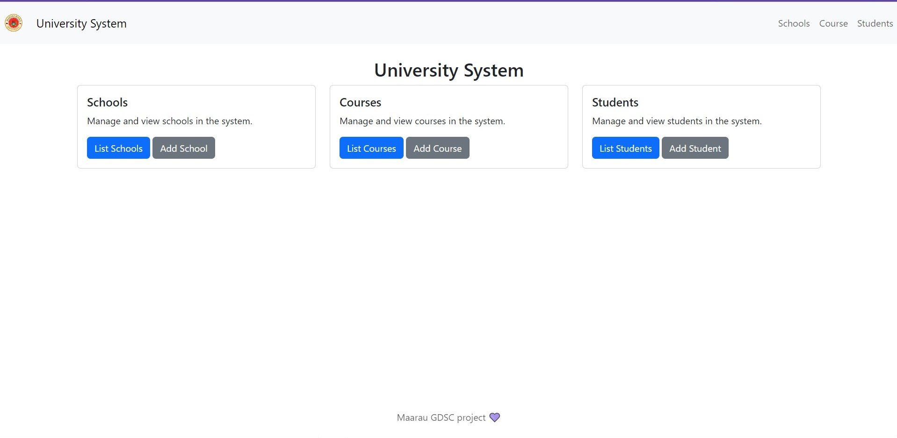
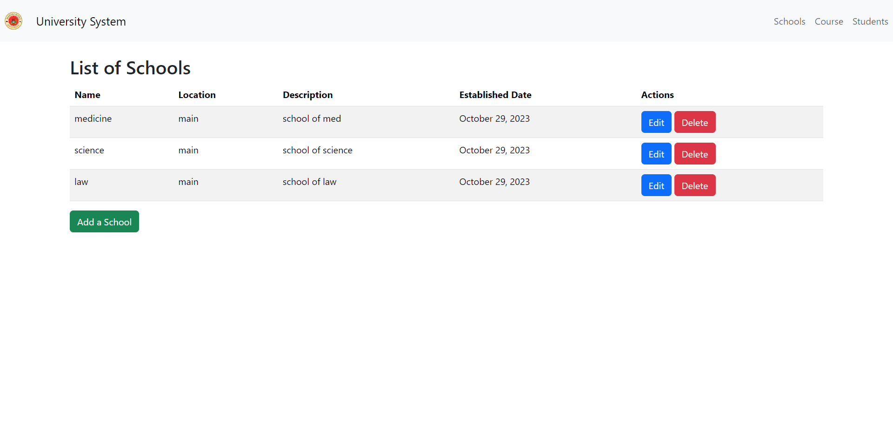
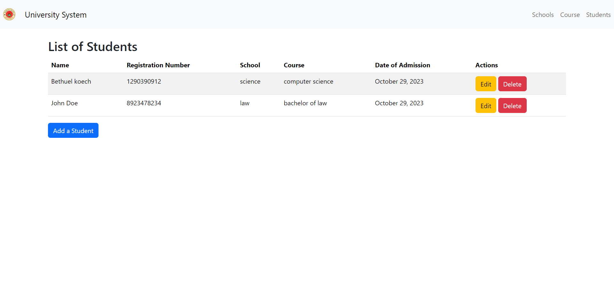

# Simple Campus System
 a Django-based project for managing schools, students, courses, and faculty.

## System Requirements

- Python: 3.10
- Django: 4.2
- MySQL: 9.1

Ensure you have Python and MySQL installed on your system. You can check if Django is installed by running:

```bash
python -m django --version
```

If Django is not installed, follow the installation instructions at [Django's official website](https://docs.djangoproject.com/en/stable/intro/install/).

## Installation

1. Clone the project from the repository:

```bash
git clone https://github.com/bethropolis/simple-campus-system.git
cd simple-campus-system
```

2. Create a virtual environment (optional but recommended):

```bash
python -m venv venv
source venv/Scripts/activate  # On Linux, use `venv/bin/activate`
```

3. Install project dependencies:

```bash
pip install -r requirements.txt
```

## Configuration

1. Rename the `.env.example` file to `.env`.

2. Edit the `.env` file with your MySQL database configuration:

```
DB_NAME=db_name
DB_USER=db_user
DB_PASSWORD=db_password
DB_HOST=db_host
DB_PORT=3306
```

## Database Setup

Run the migrations to create the database schema:

```bash
python manage.py migrate
```

## Screenshots

Here are some screenshots of the different pages:






## Usage

To start the development server, run:

```bash
python manage.py runserver
```

You can access the application in your web browser at `http://127.0.0.1:8000/`.

## License

This project is licensed under the MIT License. See the [LICENSE](/LICENSE) file for details.

---

Feel free to reach out if you have any questions or encounter issues during the setup.

Happy coding! 💜
